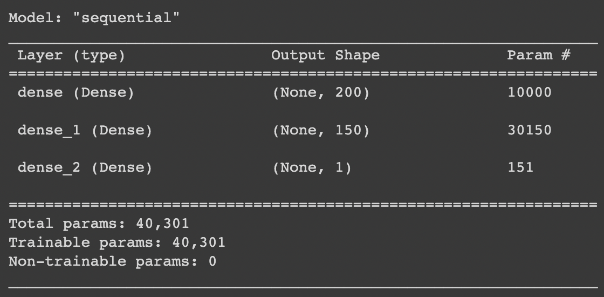
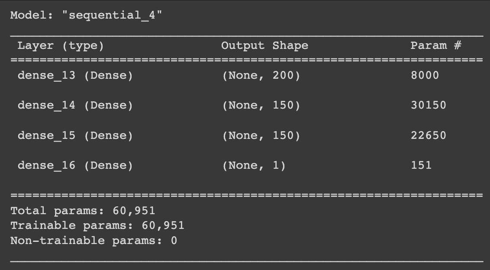

# Charity Funding Predictor

## Overview
In this assignment, we were tasked with building a neural network to predict whether a charity will successful with funding received from the non-profit foundation "Alphabet Soup". The source data used to train the model contains records of past charities funded by the organization and whether or not the money was used successfully. 

## Results
### Summary of the initial model  

After running this configuration of the initial model, I achieved an accuracy of 73.18%. Code can be found in the `charity_funding_predictor.ipynb` notebook in this repo, which is also accessible [on Google Collab](https://colab.research.google.com/drive/1WBt-ElxhuOJto9fcZMN8fNk2qENH2d3S?usp=sharing).

### Summary of the optimized model  

The highest accuracy I achieved from various attempts at optimizing the initial model was 73.27%, which used the above configuration. Code can be found in the `AlphabetSoupCharity_Optimization.ipynb` notebook in this repo, which is also accessible [on Google Collab](https://colab.research.google.com/drive/1Xkf0Y6dWo4TaJQ_OIBWZUzO5dyXHdmNl?usp=sharing).

### Data Preprocessing
The source data contains the following fields:
* EIN and NAME—Identification columns
* APPLICATION_TYPE—Alphabet Soup application type
* AFFILIATION—Affiliated sector of industry
* CLASSIFICATION—Government organization classification
* USE_CASE—Use case for funding
* ORGANIZATION—Organization type
* STATUS—Active status
* INCOME_AMT—Income classification
* SPECIAL_CONSIDERATIONS—Special consideration for application
* ASK_AMT—Funding amount requested
* IS_SUCCESSFUL—Was the money used effectively

For the initial model, the "EIN" and "NAME" fields were removed from the dataset as they do not provide useful information for the model. In the optimized model, "SPECIAL CONSIDERATIONS" was also removed to see if it would improve the performance of the model. Since this field is very vaugue (Y/N), I thought it might just create noise.    

The rest of the fields were used as input features for the model. "APPLICATION_TYPE" and "CLASSIFICATION" were binned using cutoffs of 500 and 100 rows respectively. In the optimized model, ASK_AMT was also binned into three values:
* $5000 or less
* Between $5000 and $1M
* Greater than $1M   

"IS_SUCCESSFUL" was used as the target for both models.

### Compiling, Training, and Evaluating the Model
* How many neurons, layers, and activation functions did you select for your neural network model, and why?
    * I ran my first attempt with one hiddel layer of 150 nodes. I used the metric of roughly 3 times the input to determine the number. I then tried two layers with 150 nodes and finally one layer with 200 and one with 150 nodes. These resulted in only minor improvements to accuracy so I stopped adding nodes/layers.
    * In optimizing the model, I added a third layer with 150 nodes on my forth attempt. This resulted in the highest accuracy, but only by a very small margin.
* Were you able to achieve the target model performance (>75%)?
    * I was not. All of my attempts yielded between 72 and 73% accuracy.
* What steps did you take in your attempts to increase model performance?
    * After running the initial model, I attempted to increase performance by binning the "ASK_AMT" field, as it contained a wide range of values. I removed the "SPECIAL_CONSIDERATIONS" column as it didn't seem to contain enough detail to be useful. I tried increasing the number of epochs from 100 to 200 and finally tried reducing the number of bins for the "APPLICATION_TYPE" and "CLASSIFICATION" fields

## Summary

I was unable to acheive an accuracy higher than 73.27%. Future attempts could utilize `keras-tuner` to see if adjusting the activation function, number of hidden layers, and/or number of nodes would improve performance.